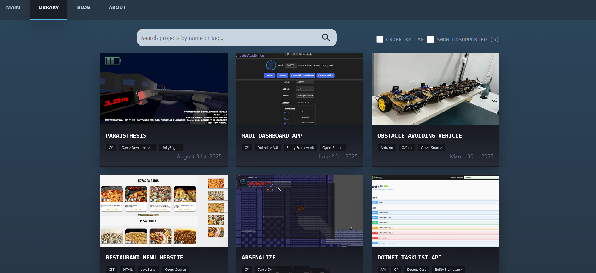
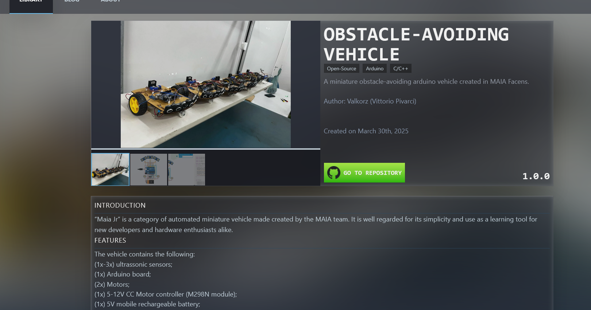

# 📝 WEBSITE PORTFOLIO 📝

This is a portfolio website created with Astro and Tailwind CSS to display my personal achievements, projects and other information.

---
### ⚙️ IMPLEMENTATION

This project was created using the Astro framework along with Tailwind CSS. 

**Why Astro?**
Choosing astro — alongisde **Tailwind CSS** — was a deliberate choice, due to my demand for a highly responsive, attractive and performant website. Astro uses the "Islands Architecture" design pattern, which renders the entire website as a static HTML page on the server, only sending JavaScript when necessary. This turned out as an amazing choice for my portfolio needs. Tailwind CSS was also a great match, due to its ease of use and great reputation.
Combining both Astro and Tailwind CSS allowed me to easily develop a well-decorated user interface whilst avoiding pollution caused by style definition, increasing readability and maintainability.



---
### 💻 Execution

In order to execute the project, you can either:

- Access the GitHub pages deployment through the following URL:
http://valkorz.github.io/website-portfolio/

**OR**

- Clone the repository, install dependences and run the project in developer mode:

1. ```git clone https://github.com/Valkorz/website-portfolio```

2. ```npm install```

3. ```npm run dev```

---
### 🖌️ DESIGN

This project's design is heavily inspired by Steam's desktop application design. I took great inspiration from how the games library is displayed, along with effects such as blurred images, shadows, shiny borders and colors.


