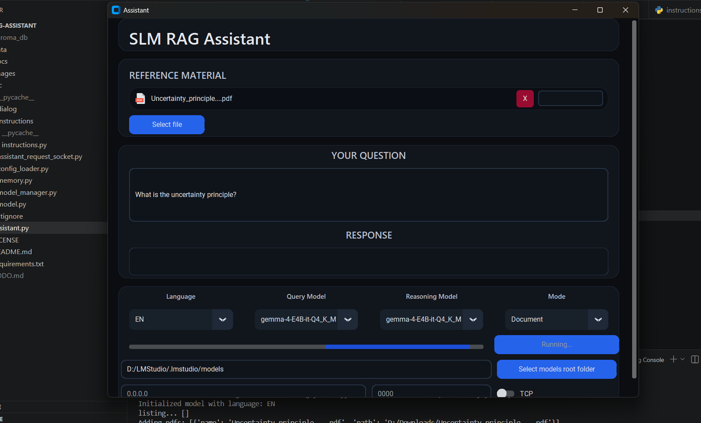
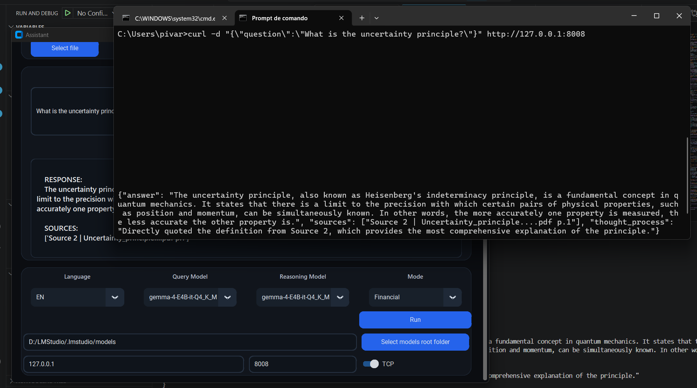
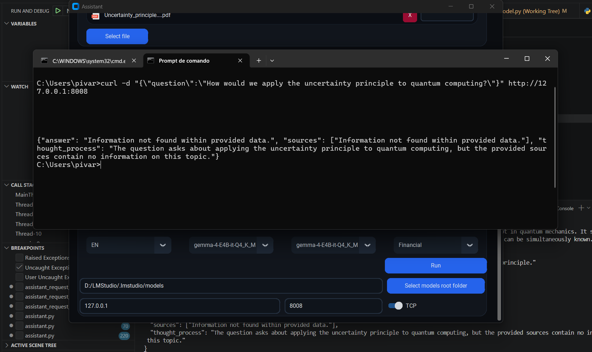

# 📃 INTRODUCTION

This project that aims to showcase the capabilities of locally hosted language models, pushing its boundaries by using prompt design and curated documents stored inside a vector database. Upon initializing the application, a TKinter window will appear, allowing the user to select documents and ask a question regarding the files' contents. The model will be loaded inside the system memory and initiate, performing four crucial steps: 

- **Document Ingestion:** The running application will read and ingest all the document's data inside a local `ChromaDB` database.
- **Query Generation:** The application will perform a prompt to the active model, requesting the generation of a certain number of queries, which will be used to recall chunks of data from the `ChromaDB` database that answers the user's initial inquiry.
- **Chunk Retrieval:** The application will retrieve chunks from the database that semantically match the generated queries.
- **Response Generation:** Using the resulting chunks of data from the database search, the model will be once again prompted to generate a response to the user's initial question, using the data as a strict basis.

# ⚙️ USAGE

Upon execution, the application will showcase a user interface. The interface allows the user to perform several commands such as: adding documents, performing questions, selecting models root path **(*GGUF files)**, selecting model language and opening a TCP server to receive questions through a dedicated IP Address/Port combination.

As per shown in the following image, activating the 'TCP' switch allows the application to open a TCP port, which can be used to receive questions headlessly, through the network.

Adding more documents will allow the model to understand a wider array of topics and provide more informed answers based on curated sources. The model is restricted to only answering based on the existing materials and, if no answer is found, it will simply respond: "Information not found within provided data."

# 💡 PRACTICAL APPLICATIONS

This projects features many practical applications, notably in tasks that require analysis of complex and lengthy documents. The ability for this solution to deconstruct data and highlight the truly important details proves advantageous for situations where large amounts of information need to be sourced in small intervals, and is currently being done manually. 
An example for this could be as a retrieval mechanism for personalized solutions, such as a financial management platform, allowing the system to poll the user's previous actions, financial decisions and backstory to provide particular guidance, all while completely local and private.

